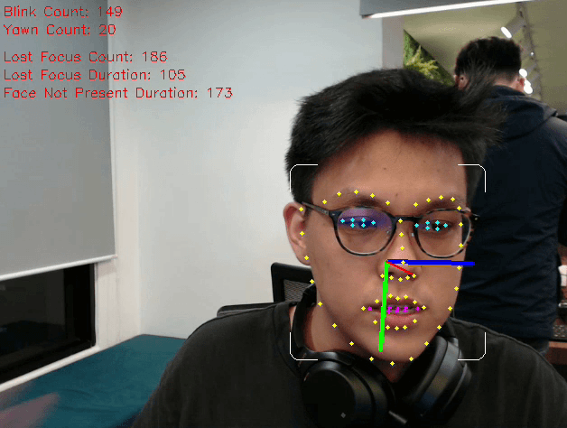

# Online Classroom Attention Tracker (OCAT)

Client:
`python main.py --userid 123`

`python main.py --userid kenghooi --host 10.10.0.106`

- [x] Real time data visualization with PyQtGraph
- [x] Face landmarks -eye, mouth monitor
- [x] Head pose estimation
- [x] Server-side, Client-side data streaming(pub,sub)
- [x] Post-session Attention Metrics Dashboard
- [ ] face,person detection - attendance
- [ ] human pose estimation - engagement, ergonomics

### Contributors
William Ardianto, Kenghooi Teoh, Leonard Loh, Choo Wilson.

### Pretrained Weights
- [Dlib face landmarks weight - GDRIVE](https://drive.google.com/file/d/1o-lotnZJcSCuHixTI9ponYNXjBmbMggt/view?usp=sharing)
- [Dlib face landmarks weight](https://github.com/AKSHAYUBHAT/TensorFace/blob/master/openface/models/dlib/shape_predictor_68_face_landmarks.dat)
- [Hopenet pretrained weight](https://drive.google.com/open?id=1m25PrSE7g9D2q2XJVMR6IA7RaCvWSzCR)

### References

- Boilerplate opencv python code, read frame from webcam, image, video. [Show me the code](https://github.com/yptheangel/opencv-starter-pack/tree/master/python/basic)
- [Hopenet](https://github.com/natanielruiz/deep-head-pose) by *Nataniel Ruiz*
- [PyImageSearch](https://www.pyimagesearch.com/2017/04/03/facial-landmarks-dlib-opencv-python/) Facial landmarks with dlib, OpenCV, and Python
- [PyImageSearch](https://www.pyimagesearch.com/2017/05/08/drowsiness-detection-opencv/) Drowsiness detection with OpenCV 

